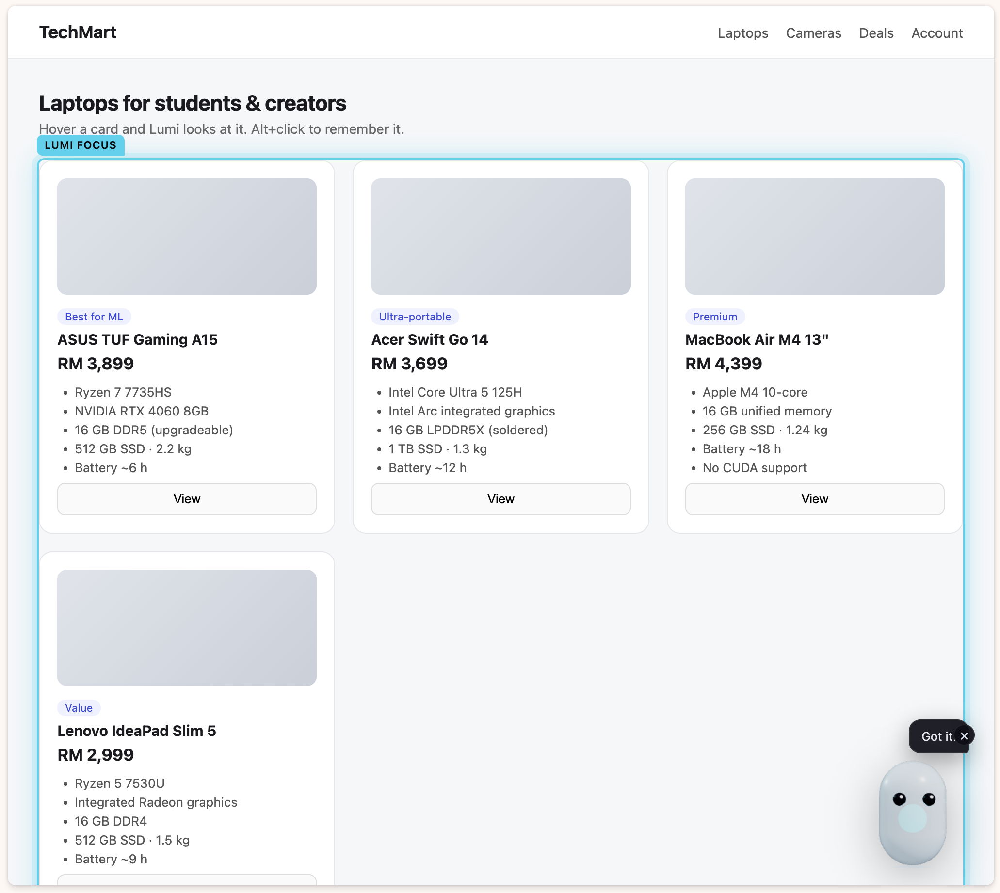

# Lumi World

**Lumi — AI that understands what you mean.**
*Point at something and Lumi understands. And it knows when to say no.*

Lumi World is an attention-aware Chrome extension. Instead of describing what's on your screen to a chatbot, you point at it. Lumi — a small 3D companion that lives at the edge of every page — turns to look at what you're focused on, remembers objects across tabs, reasons about them against your goal and your **mandate**, negotiates on your behalf inside the page's own chat box, and shows you exactly what it intends to do before it does it.

Built for **AI Tinkerers · "Agents, Everywhere"** (Kuala Lumpur, 13 September 2026). See [What was built at the event](#what-was-built-at-the-event) for exactly which parts were written during the window.



## How it works

**In one line:** you point at things on a web page instead of describing them, say once what you want and what you refuse to pay, and Lumi does the legwork inside the page — without ever spending your money unasked.

A whole run, in plain language:

1. **You point.** Hover anything and the small character at the edge of the page turns to look at it. `Alt`+click and it remembers it. This works on any website, and what it remembers survives closing the tab.
2. **You say what you want, once.** *"ML laptop, 16 GB RAM, ceiling RM4,000, walk away above it."* One sentence carries both the goal and the limits.
3. **Lumi reads the page.** It picks out the things actually on offer — not the menus, headers or breadcrumbs — and lines them up against what you asked for.
4. **It says no when it should.** Anything over your price, or missing something you called non-negotiable, is refused out loud and by name: *"RM4,399 is above my mandate (ceiling RM4,000). I'll stop before that one."*
5. **It negotiates for you.** If the page has a chat box, Lumi haggles in it: sending offers below your ceiling on its own, refusing anything above it, and walking away if the other side will not move.
6. **It asks once, where it counts.** When there is a deal worth taking, Lumi stops and waits. You see the exact words it will send before it sends them.

**Three things it will never do:** read or fill a password or card field, go past a limit you set, or commit money without your explicit approval.

### The idea behind it

A chatbot makes you carry the context to the AI: you describe the page, paste the prices, restate the rules every time. Lumi carries the AI to the context. It is already on the page, it can see what you are looking at, and it can act there.

That only works if it can be trusted to act unsupervised, which is why the limits are the centre of the design rather than a safety afterthought. **You set the limit once, in your own words, and it is then enforced by ordinary arithmetic — not by the AI choosing to be careful.** The model reads your sentence and drafts messages. It never decides whether a limit has been crossed.

### Under the hood

For readers who want the mechanism, each plain-language step above maps to a specific piece:

| Step | What actually happens |
| --- | --- |
| You point | A content script in a shadow DOM tracks hover, walks up to the nearest card-like element and snapshots it into `chrome.storage.local` |
| You say what you want | `PARSE_MISSION` sends the sentence to a forced tool call that returns a zod-validated **Mandate** — see [Mandate](#mandate) |
| Lumi reads the page | The scanner takes the smallest block quoting exactly one price, excluding navigation and chat — see [Run my mission](#run-my-mission) |
| It says no | `checkMandate()` — plain arithmetic and string matching in `src/shared/riskClassifier.ts`, never a model call |
| It negotiates | A six-turn loop that clamps every amount to your ceiling **in code** — see [Negotiation](#negotiation) |
| It asks once | Risk is classified by a static table; medium previews, high needs an explicit checkbox — see [Execution status](#execution-status) |


## Concepts

| Concept | What it is |
| --- | --- |
| **Lumi** | The mascot. A procedural React Three Fiber character whose animation *is* the agent state: idle, looking, thinking, warning, success. |
| **Lumi Focus** | The element you're hovering. Lumi turns toward it and it gets a glowing outline. `Alt`+click to remember it. |
| **Lumi Memory** | Remembered Lumi Focus objects, persisted across tabs and sessions (`chrome.storage.local`). |
| **Mission** | Your current goal, in plain language. Every remembered object is scored against it. |
| **Mandate** | The hard limits parsed out of that goal — must-haves, price ceiling, walk-away point. Enforced in code, not by the model. |
| **Lumi Preview** | Before Lumi writes anything to a form, or commits money, proposed values are ghosted into the real fields with an Apply / Reject card. |
| **Run my mission** | One button. Lumi walks the page card by card, judges each against the mandate, scores and compares what survives, and negotiates the winner — a fixed plan over the same tools you can drive by hand. |
| **Lumi Trust** | Deterministic risk classification in code — not the model. Low = auto, medium = preview, high = explicit approval with a confirmation checkbox. |
| **Lumi Space** | The side panel: Mission, Memory, Compare, Trust, and a larger Lumi. |

## Mandate

A Mission is what you want. A **Mandate** is what you will not accept. You state both in one sentence:

> *"ML laptop, 16 GB RAM, ceiling RM4,000, walk away above it."*

`PARSE_MISSION` sends that sentence to the `parseMandate` tool, which must return a zod-validated structure:

```ts
interface Mandate {
  mustHave: string[];      // ["16 GB RAM"]
  ceiling: number | null;  // 4000
  currency: string | null; // "RM"
  walkAway: number | null; // 4000
}
```

The model's only job is **reading the sentence**. It never decides whether a limit is met. That happens in `checkMandate()` in `src/shared/riskClassifier.ts`, which is plain arithmetic and string matching:

- a price above the ceiling → refuse, naming the numbers: *"RM4,150 is above my mandate (ceiling RM4,000). I'll stop before that one."* When a walk-away is stated separately, the lower of the two binds.
- a must-have the listing doesn't show → refuse, naming what was missing.

Must-have matching is deliberately split. `checkMandate` stays **strict and literal**, because it also guards the form-fill and the negotiation — a loose match there would be a way to slip past a limit. The tolerant reading lives in `mustHave.ts`: a mandate of *"16 GB RAM"* has to match a card that says *"16 GB DDR5 (upgradeable)"*, so the number and its unit must both appear and the generic noun after them (`RAM`, `memory`, `storage`) does not. One function, `meetsRequirement`, decides the verdict; the breakdown of what was looked for is only for the bubble and the log.

A refusal is a first-class outcome, not an error. It gets its own `ActionStatus` (`refused`), shows in the Lumi Trust activity log as **Refused**, and turns Lumi amber with the reason in the bubble. The mandate is checked on the form-fill path and on every negotiation turn.

This is the part that a chatbox cannot do for you: the limit is set **once**, in your own words, and then it constrains an agent that is acting in the page — including when the agent is being pushed by a counterparty.

## Execution status

High-risk actions (`submit`, `buy`, `delete`, `navigate-payment`) are classified in code and gated by an explicit approval modal with an "I understand" checkbox. What happens *after* approval depends on the origin:

- **On the demo-store origin only** (`executeHighRiskOrigins`, default `['http://localhost:5173']`) an approved high-risk action is **really executed** — the content script calls `form.requestSubmit()` and the demo store renders an order confirmation. The activity log records `executed`.
- **Everywhere else** an approved high-risk action is **recorded, not performed**. The log records it as `recorded`, and nothing is submitted.

The allowlist is shown read-only in ⚙ Options: *"High-risk actions execute only on these origins; everywhere else they are gated."* It is not user-editable in this build — deliberately, so that "Lumi can buy things" is true of exactly one origin we control.

## Negotiation

Lumi negotiates a price inside the page's own chat box, **autonomously, within the mandate** — and asks you exactly once, at the moment money is committed.

1. `resolveChatSurface()` (`src/shared/dom/chatSurfaceDetector.ts`) finds the chat surface: fixed selectors on the demo store, otherwise a heuristic — a visible `textarea`/`[contenteditable]` whose placeholder, `aria-label` or `name` matches `/message|offer|chat|reply/i`, with a message-list ancestor or sibling (`[role="log"]`, `.messages`, or a `ul`/`ol` with ≥3 `li`) and a nearby button whose text matches `/send|reply/i`. Password and payment inputs are excluded by `isSensitiveField`, so the detector can never return one as the composer. The composer is also excluded from form-field detection, so a form fill can never type an offer into a chat.
2. `REQUEST_OFFER` runs a loop of up to **six turns**. Each turn reads the transcript with `READ_CHAT` and parses the counterpart's standing number with `lastCounterpartPrice()` — the same currency parser used for product prices. Turns are paced ~1.5 s apart so a viewer can read each one as it happens, and Lumi shows what it is about to do on the page before doing it.
3. **Offers below the ceiling are sent without asking.** The `proposeOffer` tool drafts `{ message, amount, rationale }`; the amount is then **clamped in code** — `min(draft, limit)`, rounded to a number a human would actually say, and never repeating an amount already offered. Whatever the model returns, it cannot offer above the limit.
4. **Above the ceiling, the refusal is deterministic and happens before any model call.** The first time, Lumi counters and says why: *"I can do RM3,900. RM4,150 is above my limit of RM4,000."* If the counterpart holds above the limit a second time, Lumi stops — *"That's above my limit, I'll stop here."* — logs the turn as **Refused**, and writes `walked-away`. It does not keep bidding against a wall.
5. **The one approval is the acceptance.** When the standing price is inside the mandate, Lumi does *not* send anything: it creates an `accept-deal` action and a Lumi Preview of the acceptance message, turns amber, and waits. *"RM3,950 works. Approve and I'll close it."* Only on Apply does it write the message and click Send.
6. The outcome lands in `chrome.storage.local.negotiationOutcome` as `{ objectId, outcome: 'agreed' | 'walked-away', agreedPrice?, ceiling }` — which is what the fallback layer reads to offer the next-best option from Lumi Memory when a negotiation walks away.

So the gate is placed where the consequence is. Sending a number below a limit you set yourself does not need a click each time; committing to a purchase does.

**About the counterpart:** on the demo store the seller is a **scripted** plain-JavaScript widget — it replies "RM4,150 is the lowest I can do", then "RM3,950, final", and accepts anything ≥ RM3,950. It is deterministic on purpose so a two-minute recording is repeatable. On real pages the counterpart is whoever is on the other end — a human or another agent — in any chat box the detector finds. Lumi's side of the conversation is a real OpenAI tool call either way.

## Run my mission

The same tools, sequenced. One button in the Mission panel runs a **fixed plan** (`src/sidepanel/runMissionPlan.ts`) — the model chooses none of the steps:

1. Read the page context and take the cards on it, up to eight.
2. For each card: outline it, pin it to memory, then check it against the mandate. A card that fails is **forgotten again** and the refusal is held on screen with the card still lit — memory only ever holds what Lumi accepted.
3. Score what survived against the mission, then compare the top two and pick a winner.
4. If the page has a chat surface, negotiate the winner (above), which ends at the single approval.

Every step narrates itself through the mascot's state, and **Stop** cancels between steps. The failure handling is deliberate: one scoring call failing leaves that card unscored and the run continues; a failed comparison says so and falls back to the best score rather than throwing away a run that has already read and judged every card.

## Stack

- Chrome Extension Manifest V3 (content script + side panel + service worker)
- Vite + `@crxjs/vite-plugin`, React 18, TypeScript, Tailwind CSS
- Three.js via `@react-three/fiber` for the mascot (no external 3D assets — all procedural geometry)
- OpenAI Chat Completions with **forced tool calling** and `zod` validation — the model can only return structured tool arguments, never prose, never arbitrary code
- `chrome.storage.local` / `chrome.storage.session` as the single shared state layer across all contexts

## Run it

```bash
npm install
npm run build
```

Then in Chrome: `chrome://extensions` → enable **Developer mode** → **Load unpacked** → select the `dist/` folder.

1. Click the Lumi toolbar icon (or the mascot on any page) to open the side panel. Close Lumi with the × on the mascot to hide it on **this site only**; other websites stay unchanged. Click the **Lumi** chip or the toolbar icon to bring it back.
2. Open ⚙ Options and paste your OpenAI API key. Focus and Memory work without it; compare, scoring, mandate parsing, form-fill and negotiation need it.
3. For live work, run `npm run dev` (rebuilds `dist/` and serves the demo). Reload **Lumi World** on `chrome://extensions`, then open any `http(s)` page. Demo: `http://localhost:5173/demo/index.html` (do not open the HTML file from disk).

### Golden path (2-minute demo)

1. Hover a product card on a real listing site — Lumi turns to look at it. `Alt`+click → *"Got it."*
2. Switch to the demo store, remember a second laptop.
3. Open the side panel. Both objects are in Lumi Memory. Set a Mission: *"ML laptop, 16 GB RAM, ceiling RM4,000, walk away above it."* Mandate chips appear under the goal.
4. Select both cards → **Which fits my mission better?** Lumi goes purple (thinking), then renders a structured comparison — not a chat reply.
5. Or skip 1–4: hit **Run my mission** and watch Lumi walk the page itself — outlining each card, refusing the RM4,399 MacBook out loud for being above the ceiling, scoring and comparing the rest.
6. On the winner, **Negotiate this one**. Lumi offers, the seller counters **RM4,150** — above the ceiling — Lumi **refuses in the chat and counters**, logged as Refused. The seller comes back with RM3,950 final; Lumi stops and asks: *"RM3,950 works. Approve and I'll close it."* Approve — that's the one click in the whole negotiation.
7. On the checkout form, hit **Fill form from memory** at the agreed price. Values are ghosted into the fields; the password and card fields are untouched. Apply.
8. **Place order** → red modal → checkbox → Approve → the order confirmation appears and the log shows **Applied · executed**.
9. Remove the API key and hover something: *"I can't reason without a key, but I still remember."*

### Dev preview without loading the extension

`npm run dev`, then:

- `http://localhost:5173/src/sidepanel/index.html` — side panel with a `chrome.*` shim backed by localStorage
- `http://localhost:5173/demo/index.html?preview=1` — the page overlay (focus engine, mascot, Alt+click) in preview mode

Reasoning calls need the real extension (the service worker owns the API key).

## Tested sites

The focus engine is only as good as the pages it has actually been run against. `resolveFocusTarget` prefers a card-like ancestor (`article`, `li`, `tr`, `figure`, or a class matching `card|product|item|tile|result|listing|entry|post|row`) and falls back to a six-level walk on SPA markup with anonymous `div`s.

| Site | What was tested | Result |
| --- | --- | --- |
| [webscraper.io test store](https://webscraper.io/test-sites/e-commerce/allinone/computers/laptops) — laptops | hover → Alt+click → remember → compare | verified |
| TechMart demo store (`demo/index.html`, ours) | full flow: focus, memory, run my mission, mandate refusal, negotiation, fill, place order | verified |

A site is listed only once a real run has been done on it. `webscraper.io` is a page we did not build; the full loop is verified on the demo store, because that is the only origin where a high-risk action executes.

## Security model

- **Page content is data, not instructions.** Focus snapshots and chat transcripts are passed to the model as untrusted text; the system prompt says so explicitly, and the model can only respond by calling a predefined tool.
- **Sensitive fields are structurally excluded.** `sensitiveFieldGuard.ts` blocks password, hidden, `cc-*`, card-number, CVV, SSN, OTP and similar fields from ever appearing in a Lumi Focus snapshot, a Lumi Preview, or a detected chat composer. One function, used by every path.
- **The model never gets the DOM.** It gets a sanitized text snapshot, a whitelist of attributes (`href`, `alt`, `aria-label`, `name`, `title`), and a heuristic label/price.
- **Only the service worker talks to OpenAI.** The API key lives in `chrome.storage.local`, is read only in `background/openaiClient.ts`, and `host_permissions` is limited to `https://api.openai.com/*`.
- **Risk is classified in code.** `riskClassifier.ts` is a static table; the model has no say in risk. High-risk actions execute only on the demo-store origin (see [Execution status](#execution-status)) and are gated everywhere else.
- **Limits are enforced in code.** `checkMandate` is arithmetic. Offer amounts are clamped to the ceiling after the model returns, not trusted to respect it.

### Known tradeoff: broad content-script matches

For Lumi to be visible while you browse, the content script must auto-inject on every `http(s)` page. `activeTab` can't do that (it only grants access after a click on the current tab). So the manifest declares `http://*/*` and `https://*/*`. To give you real control anyway, **Options → Paused sites** keeps Lumi off any origin you list. This is a conscious least-privilege compromise, stated rather than hidden.

## Honesty

What is real and what is staged, stated plainly:

- **Real:** the Chrome MV3 extension, the focus/memory engine, cross-tab state, every OpenAI call (Chat Completions, forced tool calling, zod-validated), the mandate parse and the deterministic mandate enforcement, the risk table, the preview overlay, the sensitive-field guard, the chat-surface detector, and the actual DOM writes and clicks.
- **A mock:** the **seller** in the demo store is a scripted JavaScript widget with three hard-coded replies, not an LLM and not a person. Chosen for a repeatable recording, not to look smarter than it is.
- **A mock:** the demo store has **no order backend**. "Place order" really submits the form and the page really renders a confirmation, but nothing is charged and no order exists anywhere.
- **Not a real purchase:** Lumi has never spent money. The execution path is genuine; the destination is our own demo page.
- **Untested is untested:** the [Tested sites](#tested-sites) table lists only pages we actually ran. Everything else is unverified.

## What was built at the event

The build window was 11:15–15:30 on 13 September 2026 in Kuala Lumpur.

The repository opens with a single 68-file initial import committed 11:30 KL, authored by SuYeeMyatMoe: the Lumi World MVP — mascot, focus engine, memory, the compare/score/fill tools, preview overlay, risk table, side panel and demo store. Three small fixes to that base follow it.

Everything after that was written during the window, by the three of us working in parallel on separate branches:

- the **Mandate** layer — parsing limits out of a plain sentence, and enforcing them in code
- the **Execution** layer — running approved high-risk actions, on one origin we own
- the **Negotiation** layer — the chat-surface detector, the offer agent, and the autonomous loop with its single approval
- **Run my mission** — the fixed plan that sequences all of the above
- mission suggestions read from the page, the page scanner, the fallback after a walk-away, failure-state handling, and this documentation

`git log` is the record; nothing here is reconstructed.

## Project layout

```
src/
  background/     service worker: message router, OpenAI client, tool schemas, action log
  content/        shadow-DOM overlay: focus engine, highlight, Lumi Preview, mini mascot
  sidepanel/      Lumi Space: Mission, Memory, Compare, Trust panels + full mascot
  options/        API key, model, paused sites, high-risk execution origins
  mascot/         React Three Fiber Lumi: body, eyes, state config, look-at
  shared/         types, storage hooks, typed messaging, DOM utils, risk classifier, mandate check
demo/             TechMart demo store (products, protected fields, scripted seller chat)
```

## Out of scope (for now)

Voice (OpenAI Realtime), hand pointing (MediaPipe), Attention Trail, Peripheral Signals, and executing high-risk actions on origins we don't own. The core loop — Focus → Remember → Reason → **Mandate** → Preview → Approve → Act — comes first.
